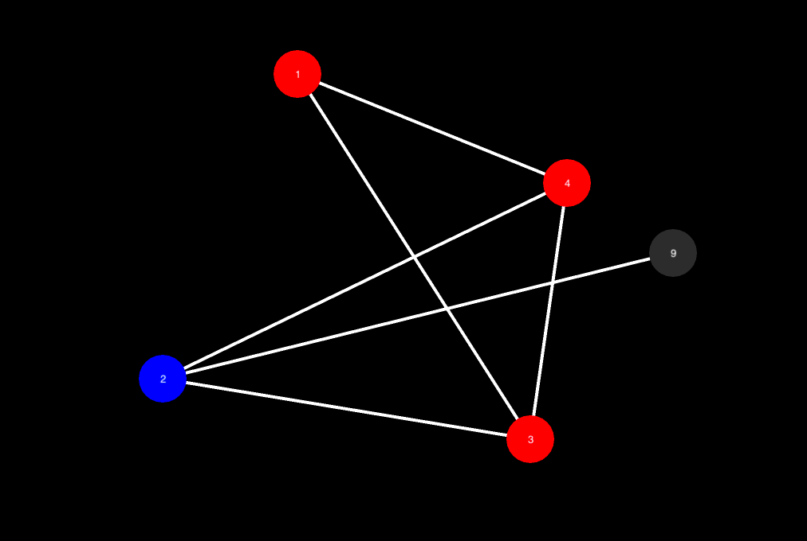

# Visgraph

* Only works for BFS and DFS right now, (more soon.)

Ever doubted your graph algorithms? 
This tool will help you visualize your graph and implementation of your algorithm.

Made using pyglet. (This project is under development.)


Run
----

`````
 ./visgraph.py
`````


Testing Custom Algorithms
-------------------------

The Graph class (./app/graph.py) implements an adjacency list graph. Add your custom algorithms as
methods and at every iteration of your algorithm save graph state to self.<_method_name_>_data (list type).
(This is same as self.bfs_data example). 

Visualize
---------

To visualize, use the self.<_method_name_>_data in visgraph.py, at on_key_press() under "symbol == key.SPACE", replace 
the default bd = graph.bfs_data with bd = graph.<_method_name_>_data.


#### Install pyglet
```
pip install pyglet
```
#### Run
```
python visgraph.py

```
- Press [SPACE].


